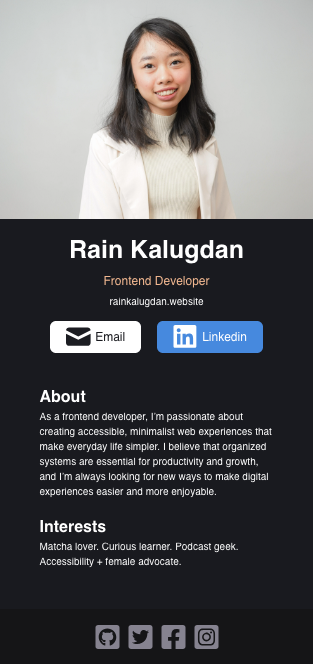
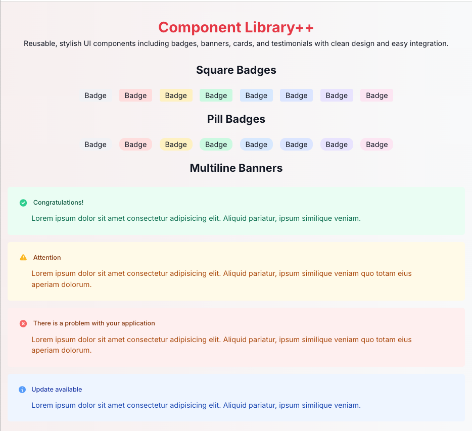
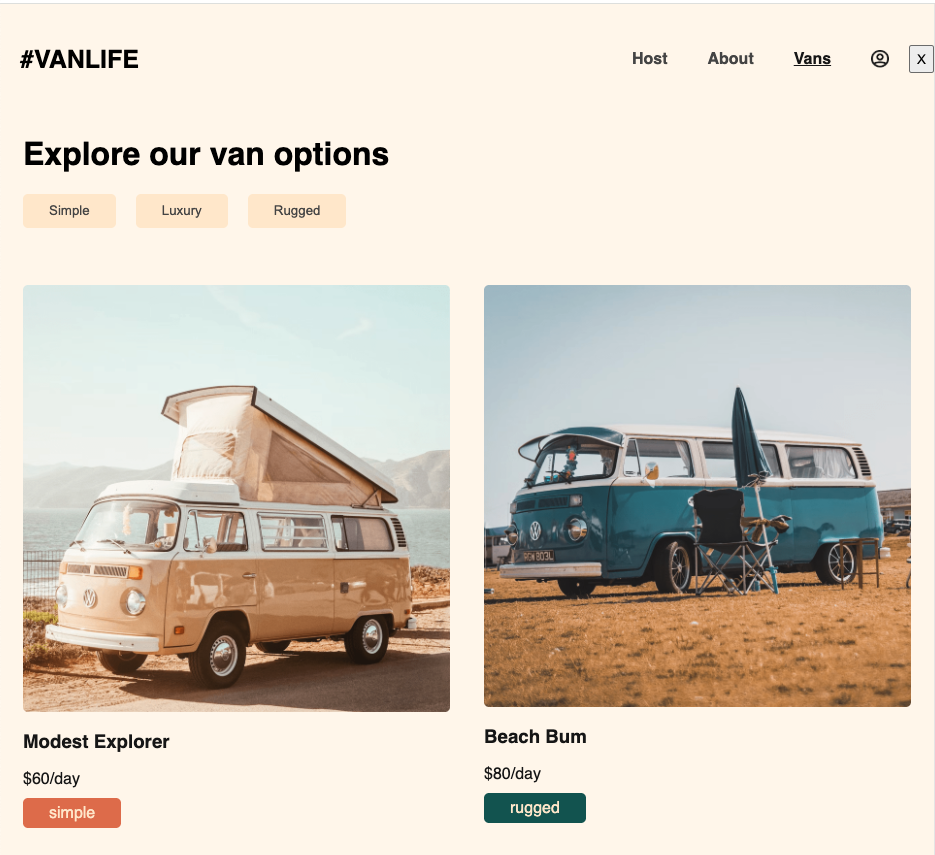

# Scrimba Frontend Projects

A collection of my projects from **Scrimba’s Frontend Developer Career Path**, showcasing _hands-on_ practice in **HTML**, **CSS**, **JavaScript**, and **React**.

> **Note:** Not all modules include solo projects.

---

## Table of Contents

- [Module 2 – Web Dev Basics](#module-2--web-dev-basics)

  - [Per Birthday Gift](#per-birthday-gift)
  - [Rain Business Card](#rain-business-card)
  - [Stars Hollow](#stars-hollow)

- [Module 3 – Making Websites Interactive](#module-3--making-websites-interactive)

  - [Kitten Purrs Counter](#kitten-purrs-counter)
  - [Mean Girls Scorecard](#mean-girls-scorecard)
  - [Password Generator](#password-generator)
  - [Unit Converter](#unit-converter)

- [Module 5 – Essential CSS Concepts](#module-5--essential-css-concepts)

  - [Mindfree Social](#mindfree-social)

- [Module 6 – Essential JavaScript Concepts](#module-6--essential-javascript-concepts)

  - [Jimmy’s Diner](#jimmys-diner)

- [Module 7 – Responsive Design](#module-7--responsive-design)

  - [NFT Site](#nft-site)
  - [Learning Journal](#rain-learning-journal)

- [Module 9 – Working with APIs](#module-9--working-with-apis)

  - [Color Scheme Generator](#color-scheme-generator)
  - [Movie Watchlist](#movie-watchlist)

- [Module 11 – React Basics](#module-11--react-basics)

  - [Rain Business Card V2](#rain-business-card-v2)
  - [Tenzies](#tenzies)
  - [Assembly Endgame](#assembly-endgame)
  - [Quizzical](#quizzical)

- [Module 12 – Advanced React](#module-12--advanced-react)

  - [Component Library](#component-library)
  - [Van Life](#van-life)

---

## Module 2 – Web Dev Basics

_Learn the basics of HTML and CSS._

### Per Birthday Gift

  

**Links:**

- <a href="https://github.com/hello-rain/scrimba-frontend-projects/tree/main/web-dev-basics/per-birthday-gift" target="_blank" rel="noopener noreferrer">Code</a>
- <a href="https://per-birthday-gift.netlify.app/" target="_blank" rel="noopener noreferrer">Live Site</a>
- [Back to Table of Contents](#table-of-contents)

**Requirements:**

- **Build** from scratch
- Use **classes**, **Flexbox**, **background images**, and **color palette**

**Stretch Goals:**

- Make it your own
- Use different GIFs
- Add a Google Font

**Author:**
Scrimba – [@hello-rain](https://github.com/hello-rain)

---

### Rain Business Card

  

**Links:**

- <a href="https://github.com/hello-rain/scrimba-frontend-projects/tree/main/web-dev-basics/rain-business-card" target="_blank" rel="noopener noreferrer">Code</a>
- <a href="https://rain-business-card.netlify.app/" target="_blank" rel="noopener noreferrer">Live Site</a>
- [Back to Table of Contents](#table-of-contents)

**Requirements:**

- **Create** a **personal digital card layout**
- Include **name**, **title**, and **contact info**
- Use **Flexbox** for layout
- Apply **color scheme** and **custom font**

**Stretch Goals:**

- Add hover effect on links
- Include profile photo

**Author:**
Scrimba – [@hello-rain](https://github.com/hello-rain)

---

### Stars Hollow

  

**Links:**

- <a href="https://github.com/hello-rain/scrimba-frontend-projects/tree/main/web-dev-basics/stars-hollow" target="_blank" rel="noopener noreferrer">Code</a>
- <a href="https://stars-hollow.netlify.app/" target="_blank" rel="noopener noreferrer">Live Site</a>
- [Back to Table of Contents](#table-of-contents)

**Requirements:**

- **Build** from scratch
- Use **Flexbox**, **images**, and **color palette**

**Stretch Goals:**

- Customize design
- Add hover effects
- Include a Google Font

**Author:**
Scrimba – [@hello-rain](https://github.com/hello-rain)

---

## Module 3 – Making Websites Interactive

_Combine HTML, CSS, and JavaScript into interactive projects._

### Kitten Purrs Counter

  

**Links:**

- <a href="https://github.com/hello-rain/scrimba-frontend-projects/tree/main/making-websites-interactive/kitten-purrs-counter" target="_blank" rel="noopener noreferrer">Code</a>
- <a href="https://kitten-purrs-counter.netlify.app/" target="_blank" rel="noopener noreferrer">Live Site</a>
- [Back to Table of Contents](#table-of-contents)

**Requirements:**

- Make it **interactive**
- Add **sound** or **counter**
- Style with **CSS**
- Add **max-width** and **responsive layout**

**Author:**
Scrimba – [@hello-rain](https://github.com/hello-rain)

---

### Mean Girls Scorecard

  

**Links:**

- <a href="https://github.com/hello-rain/scrimba-frontend-projects/tree/main/making-websites-interactive/mean-girls-scorecard" target="_blank" rel="noopener noreferrer">Code</a>
- <a href="https://mean-girls-scorecard.netlify.app/" target="_blank" rel="noopener noreferrer">Live Site</a>
- [Back to Table of Contents](#table-of-contents)

**Requirements:**

- Add **buttons** to increase or **reset score**
- Display **current score** dynamically
- Style using **Flexbox**

**Author:**
Scrimba – [@hello-rain](https://github.com/hello-rain)

---

### Password Generator

  

**Links:**

- <a href="https://github.com/hello-rain/scrimba-frontend-projects/tree/main/making-websites-interactive/password-generator" target="_blank" rel="noopener noreferrer">Code</a>
- <a href="https://minimalist-password-generator.netlify.app/" target="_blank" rel="noopener noreferrer">Live Site</a>
- [Back to Table of Contents](#table-of-contents)

**Requirements:**

- Generate **two random passwords**
- **Passwords** are **15 characters long**

**Stretch Goals:**

- Allow user to choose length
- Copy on click
- Toggle symbols or numbers

**Author:**
Scrimba – [@hello-rain](https://github.com/hello-rain)

---

### Unit Converter

  

**Links:**

- <a href="https://github.com/hello-rain/scrimba-frontend-projects/tree/main/making-websites-interactive/unit-converter" target="_blank" rel="noopener noreferrer">Code</a>
- <a href="https://easy-unit-converter.netlify.app/" target="_blank" rel="noopener noreferrer">Live Site</a>
- [Back to Table of Contents](#table-of-contents)

**Requirements:**

- Follow **design spec**
- Convert **units** between **metric** and **imperial**
- Round to **3 decimals**

**Author:**
Scrimba – [@hello-rain](https://github.com/hello-rain)

---

## Module 5 – Essential CSS Concepts

_Level up CSS skills._

### Mindfree Social

  

**Links:**

- <a href="https://github.com/hello-rain/scrimba-frontend-projects/tree/main/essential-css-concepts/mindfree-social" target="_blank" rel="noopener noreferrer">Code</a>
- <a href="https://mindfree-social.netlify.app/" target="_blank" rel="noopener noreferrer">Live Site</a>
- [Back to Table of Contents](#table-of-contents)

**Requirements:**

- Create **post layout**
- Use **semantic HTML**
- Add **hover effects**

**Stretch Goals:**

- Use JS to render multiple posts

**Author:**
Scrimba – [@hello-rain](https://github.com/hello-rain)

---

## Module 6 – Essential JavaScript Concepts

_Level up JavaScript skills._

### Jimmy’s Diner

  

**Links:**

- <a href="https://github.com/hello-rain/scrimba-frontend-projects/tree/main/essential-javascript-concepts/jimmys-diner" target="_blank" rel="noopener noreferrer">Code</a>
- <a href="https://jimmys-diner-menu.netlify.app/" target="_blank" rel="noopener noreferrer">Live Site</a>
- [Back to Table of Contents](#table-of-contents)

**Requirements:**

- Render **menu** using **JS**
- **Add**/**Remove** items
- Include **payment modal** with **validation**

**Author:**
Scrimba – [@hello-rain](https://github.com/hello-rain)

---

## Module 7 – Responsive Design

_Level up Responsive Design skills._

### NFT Site

 
   

**Links:**

- <a href="https://github.com/hello-rain/scrimba-frontend-projects/tree/main/responsive-design/nft-site" target="_blank" rel="noopener noreferrer">Code</a>
- <a href="https://real-nft-site.netlify.app/" target="_blank" rel="noopener noreferrer">Live Site</a>
- [Back to Table of Contents](#table-of-contents)

**Requirements:**

- Build a **responsive NFT preview card component**
- Use **semantic HTML** and **clean CSS structure**
- Follow the **design layout** provided

**Author:**  
Scrimba – [@hello-rain](https://github.com/hello-rain)

---

### Rain's Learning Journal

  

**Links:**

- <a href="https://github.com/hello-rain/scrimba-frontend-projects/tree/main/responsive-design/rain-learning-journal" target="_blank" rel="noopener noreferrer">Code</a>
- <a href="https://rain-learning-journal.netlify.app/" target="_blank" rel="noopener noreferrer">Live Site</a>
- [Back to Table of Contents](#table-of-contents)

**Requirements:**

- Build **responsive layout**
- Use **media queries**
- Include **blog-like posts**

**Author:**
Scrimba – [@hello-rain](https://github.com/hello-rain)

---

## Module 9 – Working with APIs

_Learn to use APIs._

  

### Color Scheme Generator

**Links:**

- <a href="https://github.com/hello-rain/scrimba-frontend-projects/tree/main/working-with-apis/color-scheme-generator" target="_blank" rel="noopener noreferrer">Code</a>
- <a href="https://mini-color-scheme-generator.netlify.app/" target="_blank" rel="noopener noreferrer">Live Site</a>
- [Back to Table of Contents](#table-of-contents)

**Requirements:**

- Fetch **data** from **The Color API**
- Display **color scheme** and **hex values**

**Stretch Goals:**

- Copy hex on click

**Author:**
Scrimba – [@hello-rain](https://github.com/hello-rain)

---

### Movie Watchlist

  

**Links:**

- <a href="https://github.com/hello-rain/scrimba-frontend-projects/tree/main/working-with-apis/movie-watchlist" target="_blank" rel="noopener noreferrer">Code</a>
- <a href="https://simple-movie-watchlist.netlify.app/" target="_blank" rel="noopener noreferrer">Live Site</a>
- [Back to Table of Contents](#table-of-contents)

**Requirements:**

- Build **two pages**: **search** & **watchlist**
- Fetch from **OMDB API**
- Store **movies** in **local storage**

**Author:**
Scrimba – [@hello-rain](https://github.com/hello-rain)

---

## Module 11 – React Basics

_Learn the basics of React._

### Rain Business Card V2

 
   

**Links:**

- <a href="https://github.com/hello-rain/scrimba-frontend-projects/tree/main/react-basics/rain-business-card-v2" target="_blank" rel="noopener noreferrer">Code</a>
- <a href="https://rain-business-card-v2.netlify.app/" target="_blank" rel="noopener noreferrer">Live Site</a>
- [Back to Table of Contents](#table-of-contents)

**Requirements:**

- Build a **personal business card** using **React components**
- Display **profile photo**, **name**, **role**, and **contact buttons**
- Include an **"About"** and **"Interests"** section
- Use **basic CSS** for layout and styling

**Author:**  
Scrimba – [@hello-rain](https://github.com/hello-rain)

---

### Tenzies

  

**Links:**

- <a href="https://github.com/hello-rain/scrimba-frontend-projects/tree/main/react-basics/tenzies" target="_blank" rel="noopener noreferrer">Code</a>
- <a href="https://mini-tenzies-game.netlify.app/" target="_blank" rel="noopener noreferrer">Live Site</a>
- [Back to Table of Contents](#table-of-contents)

**Requirements:**

- Roll **dice** until all **match**
- Track **roll count** and **timer**
- Add **confetti** on win

**Author:**
Scrimba – [@hello-rain](https://github.com/hello-rain)

---

### Assembly Endgame

  

**Links:**

- <a href="https://github.com/hello-rain/scrimba-frontend-projects/tree/main/react-basics/assembly-endgame" target="_blank" rel="noopener noreferrer">Code</a>
- <a href="https://coding-assembly-endgame.netlify.app/" target="_blank" rel="noopener noreferrer">Live Site</a>
- [Back to Table of Contents](#table-of-contents)

**Requirements:**

- Practice **React composition**
- Manage **state** with **props** and **hooks**

**Author:**
Scrimba – [@hello-rain](https://github.com/hello-rain)

---

### Quizzical

  

**Links:**

- <a href="https://github.com/hello-rain/scrimba-frontend-projects/tree/main/react-basics/quizzical" target="_blank" rel="noopener noreferrer">Code</a>
- <a href="https://fun-quizzical.netlify.app/" target="_blank" rel="noopener noreferrer">Live Site</a>
- [Back to Table of Contents](#table-of-contents)

**Requirements:**

- Two **screens** (start & quiz)
- Fetch **5 questions** from **API**
- Track **correct answers**
- Show **results** after submission

**Author:**
Scrimba – [@hello-rain](https://github.com/hello-rain)

---

## Module 12 – Advanced React

_Level up React skills with reusability, routing, and performance._

### Component Library

 
   

**Links:**

- <a href="https://github.com/hello-rain/scrimba-frontend-projects/tree/main/advanced-react/component-library" target="_blank" rel="noopener noreferrer">Code</a>
- <a href="https://simple-component-library.netlify.app/" target="_blank" rel="noopener noreferrer">Live Site</a>
- [Back to Table of Contents](#table-of-contents)

**Requirements:**

- Build **reusable React components**: **Badges**, **Banners**, **Cards**, and **Testimonials**
- Use **composition patterns** and **compound components**

**Stretch Goals:**

- Build Tooltip component
- Build Toast component

**Author:**  
Scrimba – [@hello-rain](https://github.com/hello-rain)

---

### Van Life

  

**Links:**

- <a href="https://github.com/hello-rain/scrimba-frontend-projects/tree/main/advanced-react/van-life" target="_blank" rel="noopener noreferrer">Code</a>
- <a href="https://true-van-life.netlify.app" target="_blank" rel="noopener noreferrer">Live Site</a>
- [Back to Table of Contents](#table-of-contents)

**Requirements:**

- Implement **10 routes** covering public pages and the host area.
- **Van filters** by type (e.g., **simple**, **rugged**, **luxury**) on the vans listing.
- **Active nav styling** to indicate the current route.
- **Host area pages**: **dashboard**, **income**, **vans**, **pricing** (and related host pages).
- Display relevant information under **/host/** (**summary widgets**, **host vans list**, **income**, etc.).
- Replace fake/local seed data with **Firebase** as the data source (Firestore + Auth).

**Author:**
Scrimba – [@hello-rain](https://github.com/hello-rain)
